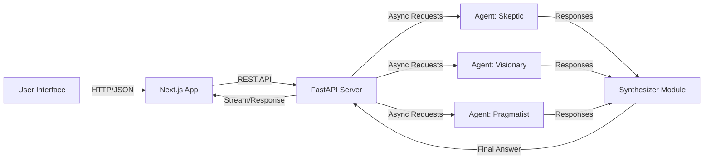

# Chat Bot Pro - AI Council Orchestrator


**Chat Bot Pro** is an advanced AI orchestration platform that leverages a "Council of Agents" architecture. Instead of a single AI response, users receive synthesized wisdom from multiple distinct personas—The Skeptic, The Visionary, and The Pragmatist—who debate and collaborate in real-time to provide comprehensive solutions.

## ✨ Key Features

- **Multi-Agent Orchestration**: Parallel execution of distinct AI personas with unique system prompts.
- **Real-Time Synthesis**: An automated "Synthesizer" agent that consolidates diverse viewpoints into a cohesive final answer.
- **Local LLM Support**: Designed to work seamlessly with local LLMs via LM Studio (compatible with Llama 3, Mistral, etc.) for privacy and cost efficiency.
- **Glassmorphic UI**: A premium, modern interface built with Next.js 14, TailwindCSS, and Framer Motion, featuring dynamic animations and responsive design.
- **Microservices Architecture**: decoupled Frontend (Next.js) and Backend (FastAPI) services, fully containerized with Docker.

## 🛠️ Tech Stack

- **Frontend**: Next.js 14 (App Router), TypeScript, TailwindCSS, Framer Motion, Lucide Icons.
- **Backend**: FastAPI (Python), AsyncIO, Pydantic, HTTPX.
- **Infrastructure**: Docker, Docker Compose.
- **AI**: OpenAI-compatible API integration (targeting LM Studio).

## 🚀 Getting Started

### Prerequisites

- [Docker Desktop](https://www.docker.com/products/docker-desktop/)
- [LM Studio](https://lmstudio.ai/) (or any OpenAI-compatible local server)

### Installation & Setup

1. **Start the Local LLM Server**:
   Open LM Studio, load your preferred model (e.g., Llama 3), and start the local server on port `1234`.

2. **Clone the Repository**:
   ```bash
   git clone https://github.com/Fuad123yuriygie/ChatBotPro
   cd ChatBotPro
   ```

3. **Launch with Docker**:
   ```bash
   docker-compose up --build
   ```

4. **Access the Application**:
   - **Frontend**: Open [http://localhost:3000](http://localhost:3000)
   - **Backend API**: [http://localhost:8000/docs](http://localhost:8000/docs) (Swagger UI)

## 🏗️ Architecture

The system follows a clean microservices pattern:



## 🤝 Contributing

Contributions are welcome! Please feel free to submit a Pull Request.
